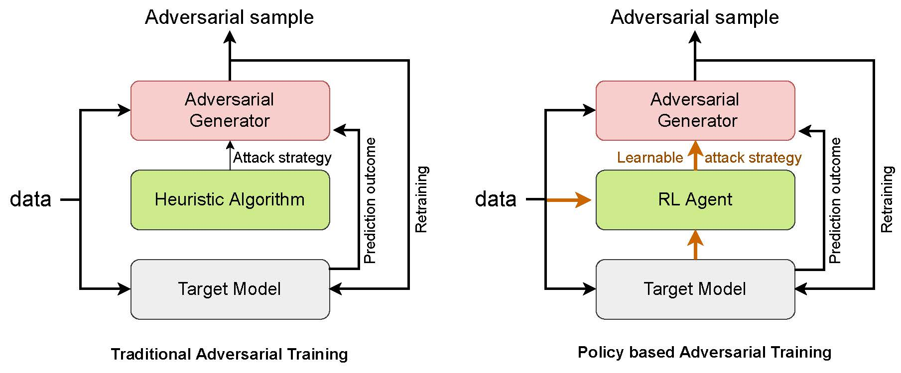
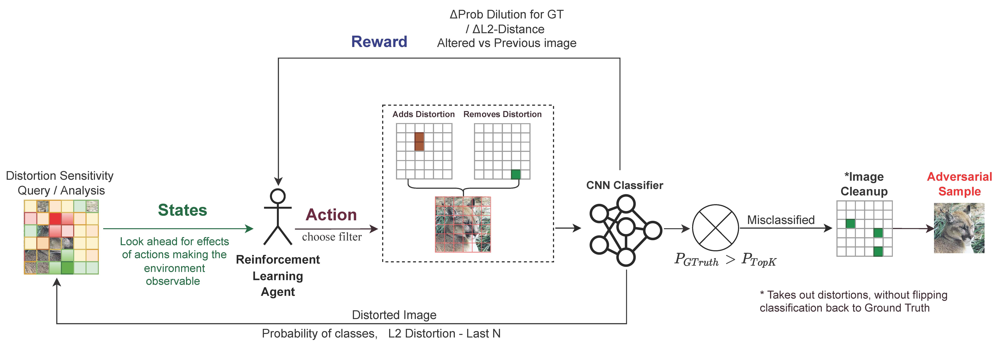
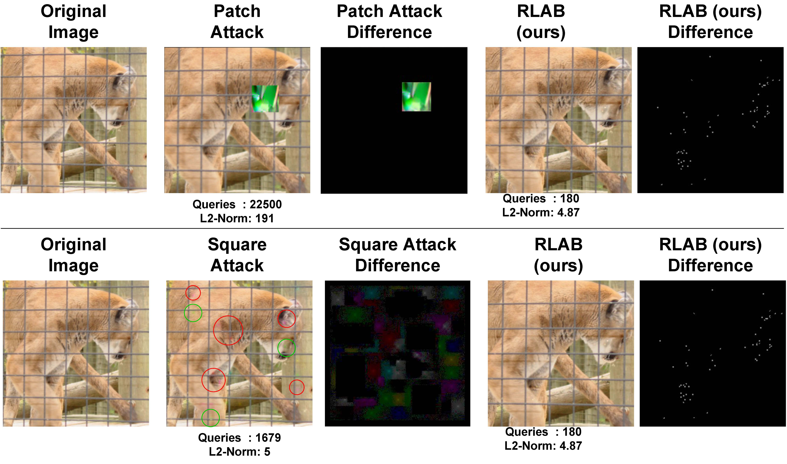

==============
How RLAB Works
==============

   Difference between RLAB and competitors

Unlike the existing traditional adversarial training approaches that use hand crafted attack strategy to generate adversarial samples, RLAB learns an attack strategy to generate more efficient adversarial samples.

   RLAB Workflow

The above figure shows the overall flow of the proposed method.  Given a data sample, RLAB divides the input into a set of grid and performs sensitivity analysis.  The agent performs two actions, one to find the patch to which distortions can be added and the patch from which earlier added distortion can be removed.  This is performed iteratively until the model misclassifies the given data sample.  The final sample with the perturbations in it is called an adversarial sample that contains information about the vulnerability of the model.

   RLAB's distortion comparison with Patch Attack and Square Attack from the literature